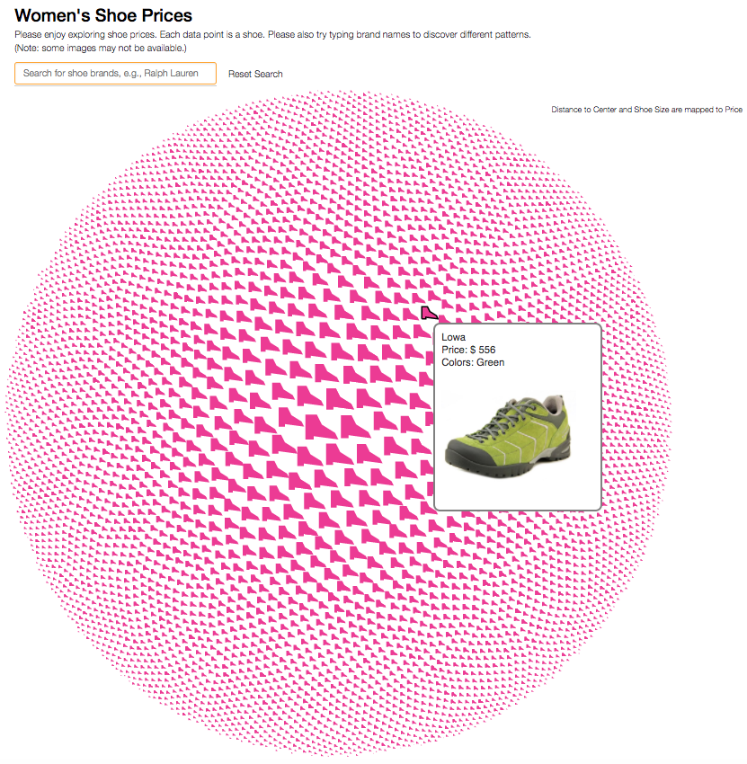
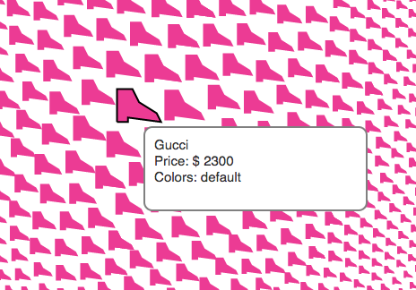
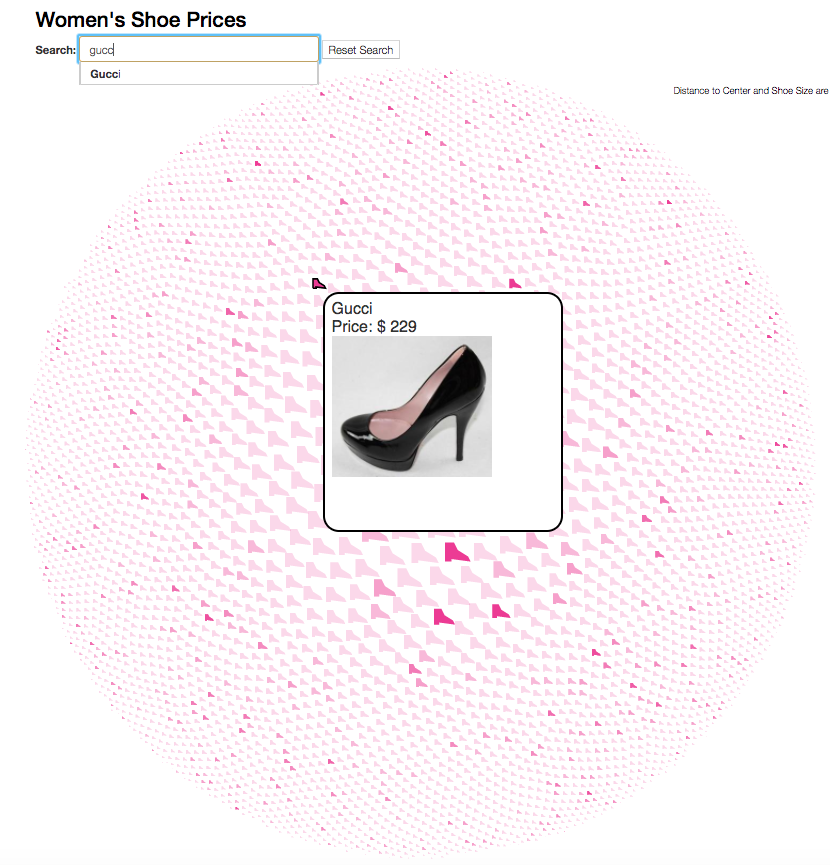
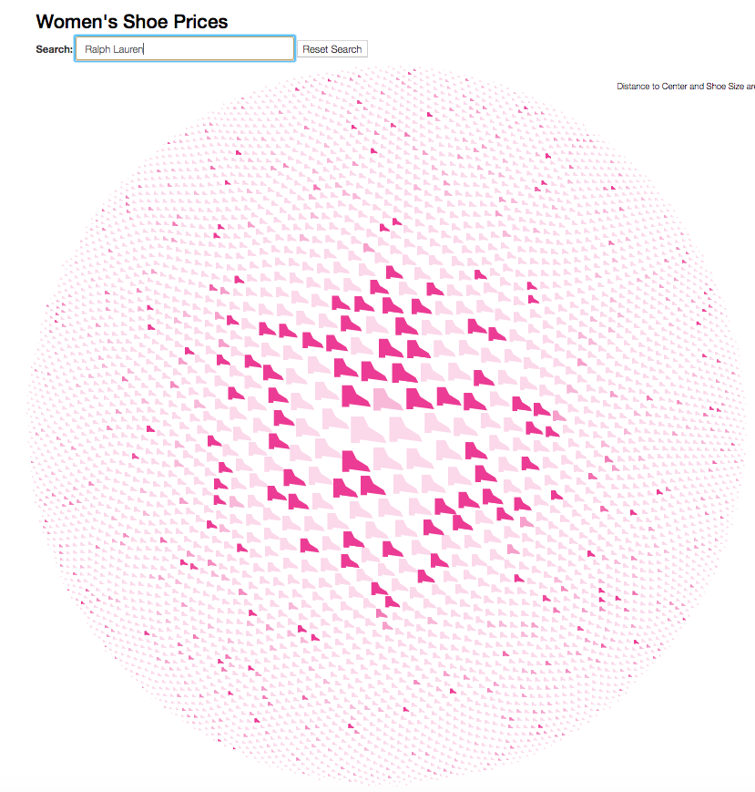

```{r, echo=FALSE, message=FALSE, warning=FALSE}
# Loading
library(imager)
library(wordcloud2)
library(tidyverse)
# library(dplyr)
library(plotly)

data <- data.frame(read.csv('../data/cleaned-womens-shoe-prices.csv'))
```

### How many shoes do we have?
```{r, echo=FALSE}
print(paste("We have",nrow(data), "pair of shoes in this dataset."))
```

### From how many brands?
```{r, echo=FALSE}
n <- data %>% 
  select(brand) %>%
  unique() %>%
  nrow
print(paste("The shoes are from",n, "brands."))
```

### What are these brands?

Make a wordcloud to have a brief overview. The bigger the word is, the more shoes the brand has in this dataset.
```{r, message=FALSE, warning=FALSE}
df.wc <- data %>% 
  select(brand, price.avg) %>%
  group_by(brand) %>%
  dplyr::summarise(n = n()) %>%
  arrange(desc(n))

wordcloud2(df.wc)
```

We can see some familiar names, such as the Nine West, Puma, and New Balance, etc, and though there appears to be just a few UGG shoes in this dataset.

### How much do the expensive brands cost?
```{r, message=FALSE, warning=FALSE}
data %>% 
  group_by(brand) %>%
  dplyr::summarise(price = mean(price.avg, rm.na=true)) %>%
  filter(price > 100) %>%
  arrange(desc(price)) %>%
  top_n(30) %>%
  ggplot(mapping = aes(x=reorder(brand, price), y=price)) + 
    geom_bar(stat = "identity", aes(fill=price)) +
    theme_light() +
    coord_flip() +
    labs(title="Expensive brands", x="Brand", y="Mean Price (USD)")

```
Top 5 brands cost us over $1000 on average, and top 30 are over $500.

### How about the cheaper brands?
```{r, message=FALSE, warning=FALSE}
data %>% 
  group_by(brand) %>%
  dplyr::summarise(price = mean(price.avg, rm.na=true)) %>%
  filter(price < 50) %>%
  arrange(desc(price)) %>%
  top_n(-30) %>%
  ggplot(mapping = aes(x=reorder(brand, price), y=price)) + 
    geom_bar(stat = "identity", aes(fill=price)) +
    theme_light() +
    scale_colour_gradient() +
    coord_flip() +
    labs(title="Cheap brands", x="Brand", y="Mean Price (USD)")
```

Kensie has $1 shoes!!!

### We just saw the mean price for each brand, but how about the prices of the individual shoes?

Plot the distribution of the shoe prices in this dataset.
```{r, message=FALSE, warning=FALSE}
data %>% ggplot(aes(x=price.avg)) + geom_histogram()
```

It is reasonable that the majority of them cost $30 to $80. Phew.

However, there is a pair of $2000+ shoes. What does it look like?
It will be figured out as we further explore the distributions for the brands.

### Price distribution for each brand?
```{r, message=FALSE, warning=FALSE}
# data %>%
#   plot_ly(x = ~price.avg, y = ~as.character(brand), type = "scatter", alpha = 0.5)

data %>%
  ggplot(aes(x=price.avg, y=as.character(brand))) + geom_point(alpha=0.5) + theme(axis.text.y=element_blank())
```

The $2000+ shoes on the right are from Gucci. Although Gucci doesn't have the highest average price, but it has super expensive shoes.

By zooming in and out, some other facts can be revealed, e.g., the prices of Ralph Lauren's shoes are very spread-out.

(Note: Originally plotly was used to create interactive visualizations, but the charts are not showing in html, thus later ggplot was used instead.)

### Expensive brands prices?
```{r}
expensive_brands <- data %>% 
  group_by(brand) %>%
  dplyr::summarise(price = mean(price.avg, rm.na=true)) %>%
  filter(price > 100) %>%
  arrange(desc(price)) %>%
  top_n(30)


data %>%
  filter(brand %in% expensive_brands$brand) %>%
  ggplot(aes(x=price.avg, y=as.character(brand))) + geom_point(alpha=0.5)

```

The top brands are indeed expensive, of which the prices range from $230 to $2300.


### Expensive brands prices?
```{r}
cheap_brands <- data %>% 
  group_by(brand) %>%
  dplyr::summarise(price = mean(price.avg, rm.na=true)) %>%
  filter(price < 100) %>%
  arrange(desc(price)) %>%
  top_n(-30)

data %>%
  filter(brand %in% cheap_brands$brand) %>%
  ggplot(aes(x=price.avg, y=as.character(brand))) + geom_point(alpha=0.5)
```

Cheap brands's prices range from $1 to $14.

### What do these expensive or cheap shoes look like? What about other details about these shoes?

An interactive visualization based on D3 was made to better display and filter shoes details, including images, color choices, etc. The intended purpose of the d3 vis is not to show a discovered trend, but to support (maybe can also encourage) a user to further explore the dataset in a flexible way.

This is an overview of the interactive visualization. Each pair of shoes in this dataset displays as a "shoe" (made with SVG path).
The shoes with higher cost are shown bigger.


### What is the most expensive pair of shoes from Gucci?

It is at the center. However, it does not have an image...


### What if I want to check a brand?

This is an example of Gucci, and its shoes are highlighted. Actually there are many cheaper shoes of this brand.



This is Ralph Lauren.


 Some brands are indeed cheaper.
 
 
 
 The visualization can be accessed through this link --  [https://users.wpi.edu/~mfeng2/womens-shoes/D3-Vis/](https://users.wpi.edu/~mfeng2/womens-shoes/D3-Vis/)