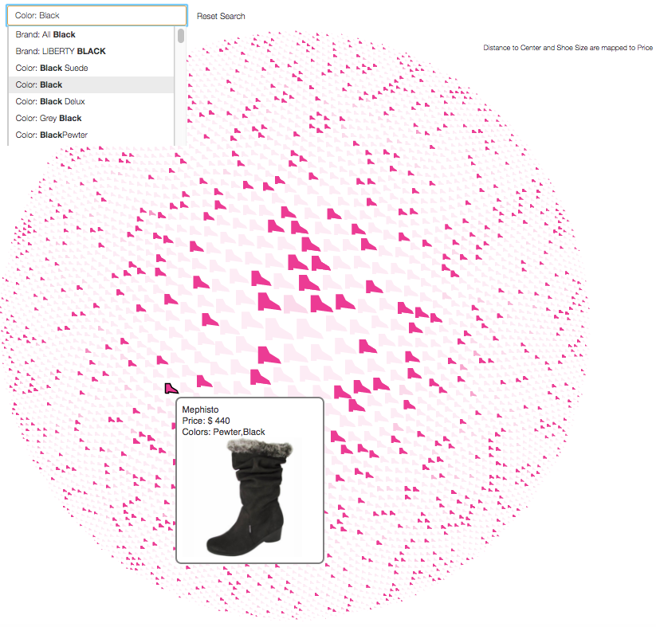

# womens-shoes

This repo contains the visualizations of the dataset [Women's Shoe Prices](https://www.kaggle.com/datafiniti/womens-shoes-prices) on Kaggle.

The dataset contains 10,000 data points (i.e., pair of shoes).
However after data cleaning, there are 4500 useful data points.

Two visualizations have been made for the data.
0. R was used to clean the data 
1. The first visualization set ([Online Access](https://users.wpi.edu/~mfeng2/womens-shoes/R-Scripts/Data-Story.html)) was made in R markdown [link to Data-Story.rmd](R-Scripts/Data-Story.rmd).
2. The second visualization ([Online Access](https://users.wpi.edu/~mfeng2/womens-shoes/D3-Vis/)) was made using D3, modified based on the starting code of one of my previous projects.

Screenshots for the second visualization:

